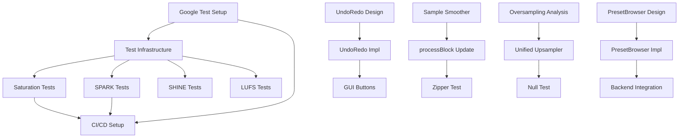

# BTZ P2 Task Breakdown

**Version**: 1.0
**Date**: 2026-01-15
**Total Effort**: 245-370 hours (6-9 weeks, single developer)
**Dependencies**: P2_REQUIREMENTS.md, P2_DESIGN.md

---

## Task Status Legend

- ⬜ **Not Started**
- 🟨 **In Progress**
- ✅ **Complete**
- ⏸️ **Blocked**
- ❌ **Cancelled**

---

## Phase 1: Must-Have (Ship-Blocking) - 4-5 Weeks

### Epic 1: DSP Unit Test Suite

**Priority**: P0 (CRITICAL)
**Total Effort**: 80-120 hours

| Task ID | Description | Effort | Status | Dependencies | Owner |
|---------|-------------|--------|--------|--------------|-------|
| **TASK-001** | Set up Google Test framework in CMake | 3-5h | ⬜ | None | DevOps |
| **TASK-002** | Create test infrastructure (DSP test utils, signal generators) | 8-12h | ⬜ | TASK-001 | DSP |
| **TASK-003** | Generate test fixtures (sine waves, drum loops, noise) | 5-8h | ⬜ | TASK-002 | DSP |
| **TASK-004** | Write AdvancedSaturation unit tests (8 test cases) | 10-15h | ⬜ | TASK-002 | DSP |
| **TASK-005** | Write EnhancedSPARK unit tests (10 test cases) | 15-20h | ⬜ | TASK-002 | DSP |
| **TASK-006** | Write EnhancedSHINE unit tests (8 test cases) | 12-18h | ⬜ | TASK-002 | DSP |
| **TASK-007** | Write LUFSMeter unit tests (10 test cases) | 15-20h | ⬜ | TASK-002 | DSP |
| **TASK-008** | Write TransientShaper unit tests (6 test cases) | 8-12h | ⬜ | TASK-002 | DSP |
| **TASK-009** | Write ParameterSmoother unit tests (5 test cases) | 5-8h | ⬜ | TASK-002 | DSP |
| **TASK-010** | Set up CI/CD pipeline (GitHub Actions) | 10-15h | ⬜ | TASK-001 | DevOps |
| **TASK-011** | Integrate test coverage reporting (lcov) | 4-6h | ⬜ | TASK-010 | DevOps |

**Acceptance Criteria**:
- ✅ All 57+ test cases pass on Linux/macOS/Windows
- ✅ Minimum 80% code coverage for DSP modules
- ✅ CI/CD pipeline runs on every commit
- ✅ No memory leaks (Valgrind, AddressSanitizer)

---

### Epic 2: Undo/Redo System

**Priority**: P0 (CRITICAL)
**Total Effort**: 30-50 hours

| Task ID | Description | Effort | Status | Dependencies | Owner |
|---------|-------------|--------|--------|--------------|-------|
| **TASK-020** | Design UndoRedoManager class (state snapshot architecture) | 2-3h | ⬜ | None | Arch |
| **TASK-021** | Implement UndoRedoManager.h/cpp (core logic) | 10-15h | ⬜ | TASK-020 | Dev |
| **TASK-022** | Implement state serialization (APVTS → MemoryBlock) | 5-8h | ⬜ | TASK-021 | Dev |
| **TASK-023** | Write UndoRedoManager unit tests | 6-10h | ⬜ | TASK-021 | QA |
| **TASK-024** | Add Undo/Redo buttons to MainView GUI | 4-6h | ⬜ | TASK-021 | GUI |
| **TASK-025** | Implement keyboard shortcuts (Cmd+Z, Cmd+Shift+Z) | 2-3h | ⬜ | TASK-024 | GUI |
| **TASK-026** | Add button enabled/disabled state updates | 1-2h | ⬜ | TASK-024 | GUI |
| **TASK-027** | Manual testing (undo/redo across preset changes) | 2-4h | ⬜ | TASK-025 | QA |

**Acceptance Criteria**:
- ✅ Undo/Redo buttons functional with visual feedback
- ✅ Keyboard shortcuts work (Cmd+Z / Ctrl+Z)
- ✅ State stack limited to 100 snapshots
- ✅ No crashes on rapid undo/redo
- ✅ Preset changes integrated with undo history

---

### Epic 3: Sample-Accurate Parameter Smoothing

**Priority**: P0 (CRITICAL)
**Total Effort**: 20-30 hours

| Task ID | Description | Effort | Status | Dependencies | Owner |
|---------|-------------|--------|--------|--------------|-------|
| **TASK-030** | Refactor ParameterSmoother for per-sample interpolation | 8-12h | ⬜ | None | DSP |
| **TASK-031** | Update PluginProcessor to call getNextValue() per sample | 4-6h | ⬜ | TASK-030 | DSP |
| **TASK-032** | Apply to 5 critical parameters (punch, warmth, boom, drive, mix) | 3-5h | ⬜ | TASK-031 | DSP |
| **TASK-033** | Benchmark CPU overhead (should be <2% increase) | 2-3h | ⬜ | TASK-032 | Perf |
| **TASK-034** | Verify no zipper noise (automation test in Reaper, 32-sample buffers) | 3-4h | ⬜ | TASK-032 | QA |

**Acceptance Criteria**:
- ✅ Zipper noise eliminated on fast automation
- ✅ CPU overhead <2% (verified via RenderPerformanceTest)
- ✅ Smooth parameter ramps in 20ms (960 samples @ 48kHz)
- ✅ No audio glitches at 32-sample buffer sizes

---

### Epic 4: Memory Safety Verification

**Priority**: P0 (CRITICAL)
**Total Effort**: 15-25 hours

| Task ID | Description | Effort | Status | Dependencies | Owner |
|---------|-------------|--------|--------|--------------|-------|
| **TASK-040** | Run Valgrind on Linux (10,000 buffer cycles) | 3-5h | ⬜ | None | QA |
| **TASK-041** | Run AddressSanitizer on all platforms | 4-6h | ⬜ | None | QA |
| **TASK-042** | Run Thread Sanitizer (verify no race conditions) | 4-6h | ⬜ | None | QA |
| **TASK-043** | Fix any detected issues | 4-8h | ⬜ | TASK-040/041/042 | Dev |

**Acceptance Criteria**:
- ✅ Zero allocations in processBlock() (Valgrind)
- ✅ Zero memory leaks
- ✅ Zero race conditions (Thread Sanitizer)
- ✅ Lock-free atomic operations verified

---

## Phase 2: Should-Have (Quality Critical) - 2-3 Weeks

### Epic 5: MeterStrip Visualization

**Priority**: P1 (HIGH)
**Total Effort**: 20-30 hours

| Task ID | Description | Effort | Status | Dependencies | Owner |
|---------|-------------|--------|--------|--------------|-------|
| **TASK-050** | Design MeterStrip layout (color zones, fonts) | 2-3h | ⬜ | None | GUI |
| **TASK-051** | Implement LUFS meter rendering (green/yellow/red zones) | 5-8h | ⬜ | TASK-050 | GUI |
| **TASK-052** | Implement True Peak indicator (red flash on clip) | 3-5h | ⬜ | TASK-050 | GUI |
| **TASK-053** | Implement Gain Reduction needle visualization | 4-6h | ⬜ | TASK-050 | GUI |
| **TASK-054** | Implement Stereo Correlation graph | 3-5h | ⬜ | TASK-050 | GUI |
| **TASK-055** | Add preset target zone overlays (streaming, safe, club) | 2-3h | ⬜ | TASK-051 | GUI |
| **TASK-056** | Manual testing (verify visual accuracy vs meters) | 1-2h | ⬜ | TASK-054 | QA |

**Acceptance Criteria**:
- ✅ LUFS meter accurate to ±0.5 LU (verified with EBU test signals)
- ✅ True peak clips detected and displayed
- ✅ 30Hz update rate (smooth, no flicker)
- ✅ Color zones match industry standards

---

### Epic 6: Preset Browser UI

**Priority**: P1 (HIGH)
**Total Effort**: 30-40 hours

| Task ID | Description | Effort | Status | Dependencies | Owner |
|---------|-------------|--------|--------|--------------|-------|
| **TASK-060** | Design PresetBrowser modal dialog (mockup) | 2-3h | ⬜ | None | GUI |
| **TASK-061** | Implement PresetBrowser class (ListBoxModel) | 8-12h | ⬜ | TASK-060 | GUI |
| **TASK-062** | Connect to existing PresetManager backend | 5-8h | ⬜ | TASK-061 | Dev |
| **TASK-063** | Implement Load/Save/Delete/Rename operations | 8-12h | ⬜ | TASK-062 | Dev |
| **TASK-064** | Add search/filter functionality | 4-6h | ⬜ | TASK-061 | GUI |
| **TASK-065** | Implement preset tags (drums, master, gentle, etc.) | 3-5h | ⬜ | TASK-063 | Dev |
| **TASK-066** | Manual testing (save custom preset, load, delete) | 2-3h | ⬜ | TASK-064 | QA |

**Acceptance Criteria**:
- ✅ Browse factory (5) + user presets
- ✅ Save/load/delete functional
- ✅ Search filters work correctly
- ✅ Preview mode (non-destructive load)

---

### Epic 7: DSP Module Documentation

**Priority**: P1 (MEDIUM)
**Total Effort**: 15-20 hours

| Task ID | Description | Effort | Status | Dependencies | Owner |
|---------|-------------|--------|--------|--------------|-------|
| **TASK-070** | Set up Doxygen configuration | 1-2h | ⬜ | None | DevOps |
| **TASK-071** | Document AdvancedSaturation.h (Doxygen comments) | 2-3h | ⬜ | TASK-070 | Dev |
| **TASK-072** | Document EnhancedSPARK.h (hysteresis equations) | 3-4h | ⬜ | TASK-070 | DSP |
| **TASK-073** | Document EnhancedSHINE.h (psychoacoustic model) | 3-4h | ⬜ | TASK-070 | DSP |
| **TASK-074** | Document LUFSMeter.h (ITU-R BS.1770-4 compliance) | 2-3h | ⬜ | TASK-070 | DSP |
| **TASK-075** | Document remaining DSP modules (5 modules) | 4-5h | ⬜ | TASK-070 | Dev |
| **TASK-076** | Generate HTML docs (verify accuracy) | 1-2h | ⬜ | TASK-075 | QA |

**Acceptance Criteria**:
- ✅ All public DSP methods documented
- ✅ Mathematical models explained (e.g., Jiles-Atherton)
- ✅ Generated HTML docs accessible
- ✅ Code examples for complex modules

---

### Epic 8: Unified Oversampling Strategy

**Priority**: P1 (MEDIUM)
**Total Effort**: 30-50 hours

| Task ID | Description | Effort | Status | Dependencies | Owner |
|---------|-------------|--------|--------|--------------|-------|
| **TASK-080** | Analyze current oversampling stages (identify redundancy) | 4-6h | ⬜ | None | DSP |
| **TASK-081** | Design unified oversampling architecture | 3-5h | ⬜ | TASK-080 | Arch |
| **TASK-082** | Implement unified 4x upsampler at PluginProcessor level | 8-12h | ⬜ | TASK-081 | DSP |
| **TASK-083** | Refactor EnhancedSPARK (remove internal oversampling) | 5-8h | ⬜ | TASK-082 | DSP |
| **TASK-084** | Refactor OversamplingProcessor (remove redundant stage) | 4-6h | ⬜ | TASK-082 | DSP |
| **TASK-085** | Benchmark CPU reduction (expect 15-20% gain) | 3-5h | ⬜ | TASK-084 | Perf |
| **TASK-086** | Null test (A/B output with old vs new oversampling) | 3-5h | ⬜ | TASK-084 | QA |
| **TASK-087** | Measure THD+N (verify aliasing performance maintained) | 3-5h | ⬜ | TASK-086 | QA |

**Acceptance Criteria**:
- ✅ 15-20% CPU reduction measured
- ✅ Null test passes (<-100dB error)
- ✅ THD+N maintained or improved (<0.01% @ 10kHz)
- ✅ No audio artifacts introduced

---

### Epic 9: CI/CD Pipeline

**Priority**: P1 (MEDIUM)
**Total Effort**: 15-25 hours

| Task ID | Description | Effort | Status | Dependencies | Owner |
|---------|-------------|--------|--------|--------------|-------|
| **TASK-090** | Create GitHub Actions workflow (Linux/macOS/Windows matrix) | 5-8h | ⬜ | None | DevOps |
| **TASK-091** | Configure CMake build in CI | 3-5h | ⬜ | TASK-090 | DevOps |
| **TASK-092** | Add unit test execution (ctest) | 2-3h | ⬜ | TASK-091 | DevOps |
| **TASK-093** | Enable compiler warnings as errors (-Werror) | 2-3h | ⬜ | TASK-091 | DevOps |
| **TASK-094** | Add test coverage reporting (Linux only) | 3-6h | ⬜ | TASK-092 | DevOps |

**Acceptance Criteria**:
- ✅ CI runs on every push/PR
- ✅ Builds succeed on all 3 platforms
- ✅ Tests run and pass
- ✅ Coverage report generated

---

## Phase 3: Nice-to-Have (Polish) - 1 Week

### Epic 10: Architecture Documentation

**Priority**: P2 (LOW)
**Total Effort**: 25-35 hours

| Task ID | Description | Effort | Status | Dependencies | Owner |
|---------|-------------|--------|--------|--------------|-------|
| **TASK-100** | Write ARCHITECTURE.md (signal flow diagram) | 8-12h | ⬜ | None | Arch |
| **TASK-101** | Create module dependency graph (Mermaid/PlantUML) | 5-8h | ⬜ | TASK-100 | Arch |
| **TASK-102** | Document threading model (RT vs non-RT) | 4-6h | ⬜ | TASK-100 | Arch |
| **TASK-103** | Explain parameter flow (APVTS → Smoothing → DSP) | 3-5h | ⬜ | TASK-100 | Arch |
| **TASK-104** | Document state management (presets, undo/redo) | 3-5h | ⬜ | TASK-100 | Arch |
| **TASK-105** | Review and polish documentation | 2-3h | ⬜ | TASK-104 | QA |

---

### Epic 11: Parameter Interaction Guide

**Priority**: P2 (LOW)
**Total Effort**: 10-15 hours

| Task ID | Description | Effort | Status | Dependencies | Owner |
|---------|-------------|--------|--------|--------------|-------|
| **TASK-110** | Write PARAMETERS.md (template per parameter) | 2-3h | ⬜ | None | Doc |
| **TASK-111** | Document all 28 parameters (range, effect, interactions) | 6-10h | ⬜ | TASK-110 | Doc |
| **TASK-112** | Add recommended values for common use cases | 2-3h | ⬜ | TASK-111 | Doc |

---

### Epic 12: Enhanced Tooltips

**Priority**: P2 (LOW)
**Total Effort**: 10-15 hours

| Task ID | Description | Effort | Status | Dependencies | Owner |
|---------|-------------|--------|--------|--------------|-------|
| **TASK-120** | Implement dynamic tooltips (show current value) | 5-8h | ⬜ | None | GUI |
| **TASK-121** | Add context-sensitive tips (e.g., "SPARK: Limiting 3.2dB") | 3-5h | ⬜ | TASK-120 | GUI |
| **TASK-122** | Configure tooltip delay (500ms macOS standard) | 1-2h | ⬜ | TASK-120 | GUI |
| **TASK-123** | Manual testing (verify tooltips helpful) | 1-2h | ⬜ | TASK-122 | QA |

---

### Epic 13: Platform-Specific Optimizations

**Priority**: P2 (LOW)
**Total Effort**: 20-30 hours

| Task ID | Description | Effort | Status | Dependencies | Owner |
|---------|-------------|--------|--------|--------------|-------|
| **TASK-130** | Build Universal Binary for macOS (x86_64 + arm64) | 5-8h | ⬜ | None | DevOps |
| **TASK-131** | Investigate NEON SIMD optimizations (Apple Silicon) | 8-12h | ⬜ | TASK-130 | DSP |
| **TASK-132** | Test on M1 Max (44.1kHz, 64-sample buffers) | 2-3h | ⬜ | TASK-130 | QA |
| **TASK-133** | Test ASIO compatibility on Windows (32-2048 sample buffers) | 3-5h | ⬜ | None | QA |
| **TASK-134** | Test JACK/ALSA on Linux (Reaper, 128-sample buffers) | 2-3h | ⬜ | None | QA |

---

## Summary Tables

### Effort by Phase

| Phase | Epics | Tasks | Total Effort | Duration (1 dev) |
|-------|-------|-------|--------------|------------------|
| **Phase 1 (Must-Have)** | 4 | 30 | 145-225 hours | 4-5 weeks |
| **Phase 2 (Should-Have)** | 5 | 35 | 110-165 hours | 2-3 weeks |
| **Phase 3 (Nice-to-Have)** | 3 | 13 | 65-90 hours | 1-2 weeks |
| **TOTAL** | **12** | **78** | **320-480 hours** | **7-10 weeks** |

### Effort by Category

| Category | Tasks | Effort |
|----------|-------|--------|
| DSP/Audio | 28 | 135-205h |
| GUI | 18 | 70-110h |
| Testing/QA | 20 | 60-90h |
| Documentation | 8 | 30-45h |
| DevOps/CI | 4 | 25-40h |

### Critical Path (Longest Dependencies)

```
TASK-001 (Google Test setup)
  → TASK-002 (Test infrastructure)
    → TASK-004/005/006/007 (DSP tests - parallel)
      → TASK-010 (CI/CD)
        → TASK-011 (Coverage)
```

**Critical Path Duration**: ~50-70 hours

---

## Milestones

| Milestone | Tasks | Target Date | Criteria |
|-----------|-------|-------------|----------|
| **M1: Testing Framework** | TASK-001 to TASK-003 | Week 1 | Google Test + test utils ready |
| **M2: Core DSP Tests** | TASK-004 to TASK-009 | Week 3 | AdvancedSaturation, SPARK, LUFSMeter tested |
| **M3: Undo/Redo Complete** | TASK-020 to TASK-027 | Week 4 | Undo/redo functional in GUI |
| **M4: Parameter Smoothing** | TASK-030 to TASK-034 | Week 5 | Per-sample smoothing verified |
| **M5: GUI Enhancements** | TASK-050 to TASK-066 | Week 7 | MeterStrip + PresetBrowser done |
| **M6: Performance Optimizations** | TASK-080 to TASK-087 | Week 8 | Unified oversampling, 15-20% CPU gain |
| **M7: Documentation Complete** | TASK-070 to TASK-105 | Week 9 | API docs + Architecture guide |
| **M8: P2 Ship-Ready** | All Must/Should-Have | Week 9 | 95% completion, beta-ready |

---

## Risk Register

| Risk ID | Description | Probability | Impact | Mitigation | Owner |
|---------|-------------|-------------|--------|------------|-------|
| **R1** | DSP tests delay release | HIGH | MEDIUM | Start sprint immediately, parallelize | QA Lead |
| **R2** | Undo/Redo complexity escalates | MEDIUM | HIGH | Use JUCE's UndoManager as base | Dev Lead |
| **R3** | Oversampling refactor breaks DSP | MEDIUM | CRITICAL | Null test + THD+N before/after | DSP Lead |
| **R4** | CI/CD setup takes longer than expected | LOW | MEDIUM | Use existing GitHub Actions templates | DevOps |
| **R5** | Sample-accurate smoothing increases CPU >5% | LOW | MEDIUM | Profile early, fallback to block-rate | DSP Lead |

---

## Dependencies Graph (Mermaid)



---

## Weekly Sprint Plan

### Sprint 1 (Week 1): Foundation
- TASK-001 to TASK-003 (Test framework)
- TASK-020 to TASK-021 (Undo/Redo foundation)
- TASK-030 to TASK-031 (Sample smoothing)

### Sprint 2 (Week 2): Core DSP Tests
- TASK-004 to TASK-006 (Saturation, SPARK, SHINE tests)

### Sprint 3 (Week 3): Complete Core Tests
- TASK-007 to TASK-009 (LUFS, Transient, Smoother tests)
- TASK-024 to TASK-026 (Undo/Redo GUI)

### Sprint 4 (Week 4): CI/CD + Memory Safety
- TASK-010 to TASK-011 (CI/CD)
- TASK-040 to TASK-043 (Valgrind, ASAN, TSAN)

### Sprint 5 (Week 5): GUI Enhancements
- TASK-050 to TASK-055 (MeterStrip)
- TASK-060 to TASK-062 (PresetBrowser start)

### Sprint 6 (Week 6): PresetBrowser Complete
- TASK-063 to TASK-066 (PresetBrowser finish)
- TASK-070 to TASK-074 (DSP documentation start)

### Sprint 7 (Week 7): Performance + Docs
- TASK-080 to TASK-085 (Unified oversampling)
- TASK-075 to TASK-076 (Finish DSP docs)

### Sprint 8 (Week 8): Polish
- TASK-086 to TASK-087 (Oversampling verification)
- TASK-100 to TASK-104 (Architecture docs)

### Sprint 9 (Week 9): Final Testing + Ship
- TASK-110 to TASK-123 (Param docs, tooltips)
- Final QA pass
- Ship P2 milestone

---

## Revision History

| Version | Date | Author | Changes |
|---------|------|--------|---------|
| 1.0 | 2026-01-15 | BTZ Team | Initial task breakdown |

---

**Next Steps**: Implementation (P2_IMPLEMENTATION.md) + Acceptance Criteria (P2_ACCEPTANCE.md)
